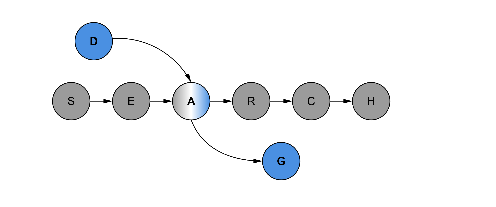

<p align="center">

</p>

# Symbolic DAG Search
Systematically searching the space of small directed, acyclic graphs (DAGs).

Published in the Paper: Scaling Up Unbiased Search-based Symbolic Regression, where it is named UDFS (Unbiased DAG Frame Search).

For some reason, Google Search did not pick up upon the original github repo. So if you found this repo via the github.io page, you can find the original repository [here](https://github.com/kahlmeyer94/DAG_search).

## Installation
**Option 1**

Clone the repository and then follow
```
conda create --name testenv python=3.9.12
conda activate testenv
pip install -r requirements.txt

... do stuff here

conda deactivate
conda remove -n testenv --all
```

**Option 2**

Copy the install script `install.sh` and then run
```
bash install.sh
```

## Usage

Lets consider a regression problem with `N` samples of inputs `X` (shape `N x m`) and outputs `y` (shape `N`). 

Estimation of an expression can be done with three types of regressors:

#### UDFS
This is the base UDFS regressor.

```
from DAG_search import dag_search
est = dag_search.DAGRegressor()
est.fit(X, y)
```

#### UDFS + Aug
This is UDFS with Augmentations as described in our paper.
Here we wrap any symbolic regressor into an outer loop that detects variable augmentations.
```
from DAG_search import dag_search, augmentations
est = dag_search.DAGRegressor() # UDFS
est_aug = augmentations.AugmentationRegressor(est) # UDFS + Aug
est_aug.fit(X, y)
```

#### UDFS + Aug + Eliminations
Here we wrap any symbolic regressor into an outer loop that detects variable eliminations.
This is especially useful if we have regression problems with a lot of inputs.
```
from DAG_search import dag_search, substitutions
est = dag_search.DAGRegressor() # UDFS
est_sub = substitutions.SubstitutionRegressor(est) # UDFS + Substitutions
est_sub.fit(X, y)
```

#### Inference of the models

The fitted expression can then be accessed via
```
est.model()
```
Note that the model is returned as a [sympy](https://www.sympy.org/en/index.html) expression.

For prediction simply use 
```
pred = est.predict(X)
```
or 
```
pred, grad = est.predict(X, return_grad = True)
```


For advanced usage see the Tutorial-Notebook `tutorial.ipynb`.

## Parameters

#### UDFS
- `k`... Number of constants that are allowed in the expression. Increasing will increase the time used for constant optimization (Default = 1).
- `n_calc_nodes`... Maximum number of intermediate calculation nodes in the expression DAG. Increasing this number will increase the search space, but allows more complex expressions (Default = 5).
- `max_orders`... Maximum number of expression - skeletons in search. If it is greater than the search space, we have a true exhaustive search (Default = 1e6).
- `random_state`... set to number for reproducibility, set to None to ignore (Default = None).
- `processes`... number of processes used in multiprocessing (Default = 1).
- `max_samples`... maximum number of datapoints at which we evaluate, Lower = Faster. Set to None to ignore (Default = None).
- `stop_thresh`... If Loss < this threshold, will stop early (Default = 1e-20).
- `loss_fkt`... Loss function to optimize for. See `dag_search.py` for other examples (Default = `dag_search.MSE_loss_fkt`).
- `max_time`... maximum runtime in seconds (Default = 1800).
- `use_tan`... If True, will search constants using a tangens transformation, which essentially covers the interval [-inf, inf]. Otherwise will use [-10, 10] (Default = False).


#### Augmentation Regressor

- `random_state`... set to number for reproducibility, set to None to ignore (Default = None).
- `simpl_nodes`... Number of intermediary nodes for possible augmentations (Default = 2).
- `topk`... Number of augmentations to consider (Default = 1).
- `max_orders`... Maximum number of expression - skeletons in search for augmentations (Default = 1e5).
- `max_degree`... Maximum degree for Polynomials (Default = 5)
- `max_tree_size`... For selecting a best model, we return best expression from pareto front with less than this number of nodes (Default = 30).
-  `max_samples`... maximum number of datapoints at which we evaluate. Set to None to ignore (Default = None).
- `processes`... number of processes used in multiprocessing (Default = 1).
- `regr_search`... symbolic regressor used to search for solutions to augmented problems. Set to None to use default UDFS (Default = None).
- `fit_thresh`... We consider models with an R2 Score greater than this as recovered. Set to > 1.0 to ignore (Default = 1-(1e-8)).

#### Elimination Regressor
- `symb_regr`... symbolic regressor that is used to tackle the reduced problems


## Rescaling Data
- If your dependend variable contains very large values, consider fitting on a rescaled variable and unscaling the model afterwards.
For example you could fit on `X, y/c` and unscale your model with 
  ```
  c*regr.model()
  ```
- Similarly you can rescale your independent variables and fit on `X/c, y`. In the final model, the unscaling can be done via sympys [substitutions](https://docs.sympy.org/latest/tutorials/intro-tutorial/basic_operations.html#substitution):
  ```
  expr = regr.model()
  expr.subs((s, c*s) for s in expr.free_symbols)
  ```

## Dimensional Analysis
In case you have measurements with units, we provide the necessary tools to perform a dimensional analysis
using [Buckingham's Pi Theorem](https://en.wikipedia.org/wiki/Buckingham_%CF%80_theorem).
```
from DAG_search import dimensional_analysis as da

# collected data
# assume we collected the four quantities charge, permitivity, length and the electric field
X = ... 

# Unit table m, s, kg, V
D = [
    [2, -2, 1, -1, 0], # charge
    [1, -2, 1, -2, 0], # permitivity
    [1, 0, 0, 0, 0], # length
    [-1, 0, 0, 1, 0], # electric field
]

# Analysis
dim_analysis = da.DA_Buckingham()
X_new, transl_dict = dim_analysis.fit(D, X)
```
Any expression in these dimensionless quantities can then be translated back into the original dimensions using

```
dim_analysis.translate(expr, transl_dict)
```


## Citation
To reference this work, please use the following citation:
```
@inproceedings{Kahlmeyer:IJCAI24,
  title     = {Scaling Up Unbiased Search-based Symbolic Regression},
  author    = {Kahlmeyer, Paul and Giesen, Joachim and Habeck, Michael and Voigt, Henrik},
  booktitle = {Proceedings of the Thirty-Third International Joint Conference on
               Artificial Intelligence, {IJCAI-24}},
  publisher = {International Joint Conferences on Artificial Intelligence Organization},
  editor    = {Kate Larson},
  pages     = {4264--4272},
  year      = {2024},
  month     = {8},
  note      = {Main Track},
  doi       = {10.24963/ijcai.2024/471},
  url       = {https://doi.org/10.24963/ijcai.2024/471},
}
```
